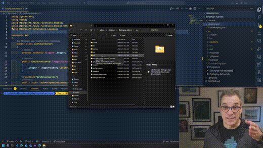

# Zip Deploy Azure Function

This is a simple example of how to deploy an Azure Function using ZipDeploy. This is a very simple way to deploy an Azure Function without having to use a full CI/CD pipeline.

## Using ARM Template

By clicking the button below, you will deploy a .NET 8 Azure Isolated Function in your subscription. The deployment uses the ARM template [azuredeploy.json](deployment/azuredeploy.json) and will deploy the zip file contained in the release of this repository.

To learn more about how the template was done refer to the blog post on [How to Deploy a .NET isolated Azure Function using Zip Deploy in One-Click](https://www.frankysnotes.com/2024/04/how-to-deploy-net-isolated-azure.html) on frankysnotes.com.

There is also a video on [YouTube](https://www.youtube.com/watch?v=LHJTUvjw9po).

## Using Azure Developer CLI (AZD) and Bicep

You can also deploy the function using AZD command. From the folder *deployment* run the command `azd init` then `azd up` to deploy the function. This will use the [main.bicep](deployment/infra/main.bicep) file to deploy the function.

